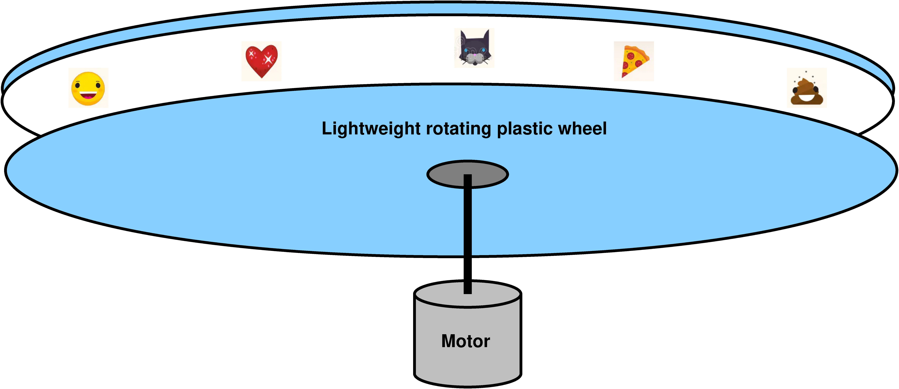
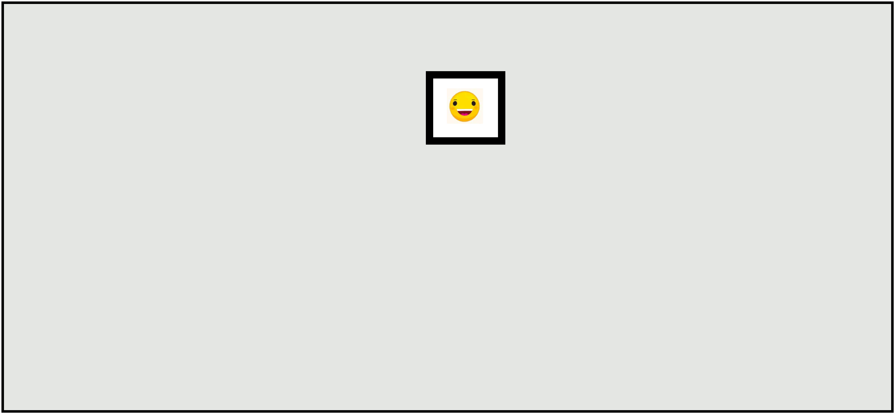

# Project 212 Simple Command Robot

This repo provides sample code using the [Command Robot](https://docs.wpilib.org/en/stable/docs/software/commandbased/index.html) framework.  The imaginary robot does a very simple task described below, and demonstrates how to use the Command Robot software building blocks.

When creating new robot code, it may be helpful to copy this code and change the small portion that actually makes the robot do anything.

# The imaginary robot

Our imaginary robot has a wheel of emojis that it can rotate through, in order to display one of them.  A motor rotates that wheel, changing the displayed emoji.  The motor can rotate left or right.  That's it.  No drive train, no sensors, just one motor.  Very simple.

Emoji robot, showing internals                  | Emoji robot with case hiding internals
:----------------------------------------------:|:-------------------------------------:
 | 

# Electrical

- Rotating the motor at 30% power for 2 seconds advances the emoji wheel by one emoji.
- The motor is set to CAN bus ID 7.

# User interface

- When the user presses the left bumper, the motor rotates the emojis left by one unit, and then stops.
- When the user presses the right bumper, the motor rotates the emojis right by one unit, and then stops.

# The emoji subsystem

The Command Robot framework requires us to define [subsystems](https://docs.wpilib.org/en/stable/docs/software/commandbased/subsystems.html).  This simple robot has only one subsystem: the emoji subsystem.  The emoji subsystem can perform three operations: set the motor to turn left at the correct speed, set the motor to turn right at the correct speed, and stop the motor.

Note that making sure that the motor turns off after advancing by one emoji is NOT part of the subsystem's responsibility.  That responsibility is located in the [command](https://docs.wpilib.org/en/stable/docs/software/commandbased/commands.html).

Subsystems are responsible only for being able to read from their sensors and being able to activate their actuators in appropriate ways.  Complex behavior like sequencing operations or timing an operation or performing an operation until a sensor indicates it's time to stop -- all those things belong in commands, not subsystems.  Commands make use of subsystems.

# The commands

There are two commands that make use of the emoji subsystem: one command to advance the emojis one unit to the left, and another command to advance them one unit to the right.  Like all [commands](https://docs.wpilib.org/en/stable/docs/software/commandbased/commands.html), these each have an initialize, execute, and end phase, and an isFinished test.  This allows basic subsystem functionality (like rotate_right and stop) to be built up into complex behavior like "rotate to the right for exactly two seconds".

# Summary

Read through the code for this simple example robot.  Things to note:

* Constants, such as the CAN bus ID for each motor, are defined in `constants.py`.  (A real robot would define many more constants!)

* Subsystems define how to read sensors and activate actuators, but no complex behavior.  They are defined in the files in the `subsystems/` directory.

* Commands use subsystems and apply programming logic to create complex behaviors.  They are defined in the files in the `commands/` directory.

* Controller buttons can trigger commands.  Associating a controller action with a command is called "binding".  Bindings are defined in the `robotcontainer.py` file, in the `configureButtonBindings()` method.

* The emoji subsystem, commands, and bindings are only useful for this imaginary robot.  If you're using this as example code to create your own robot, you'll define your own subsystems, commands, and bindings, and you can delete the ones related to the emoji robot.

* If you're creating your own robot, you probably won't need to make any changes to `robot.py`.